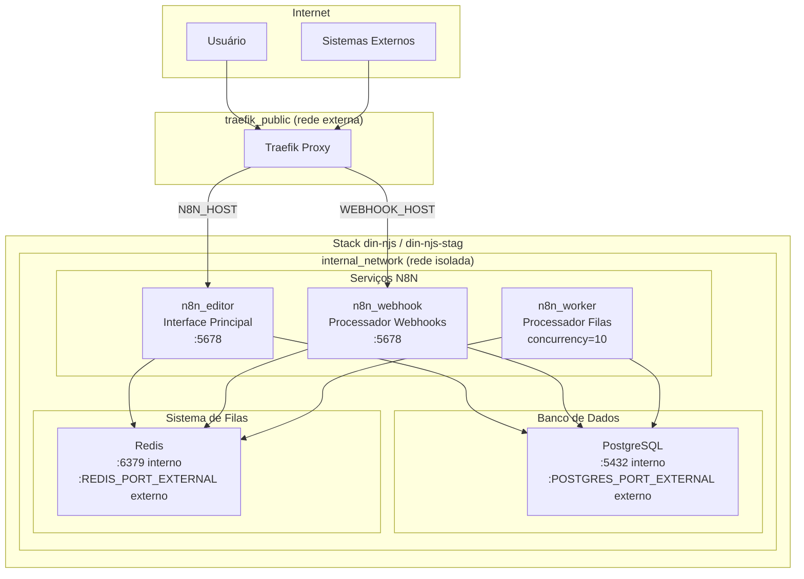
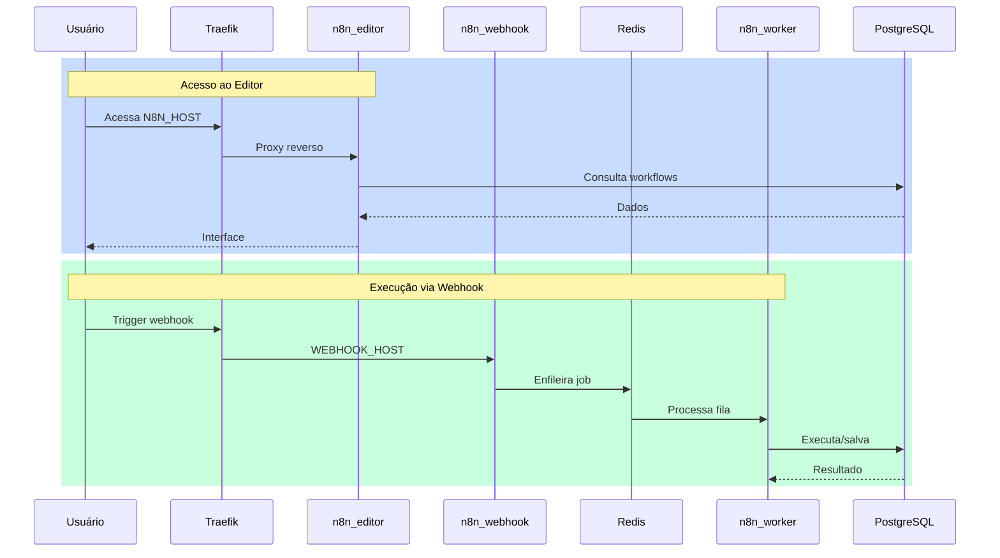
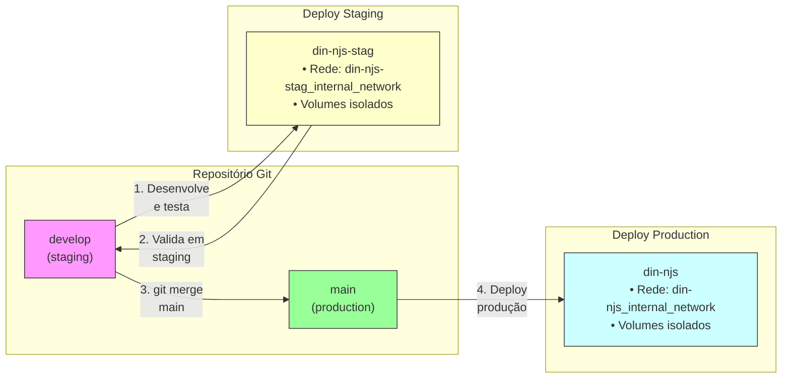
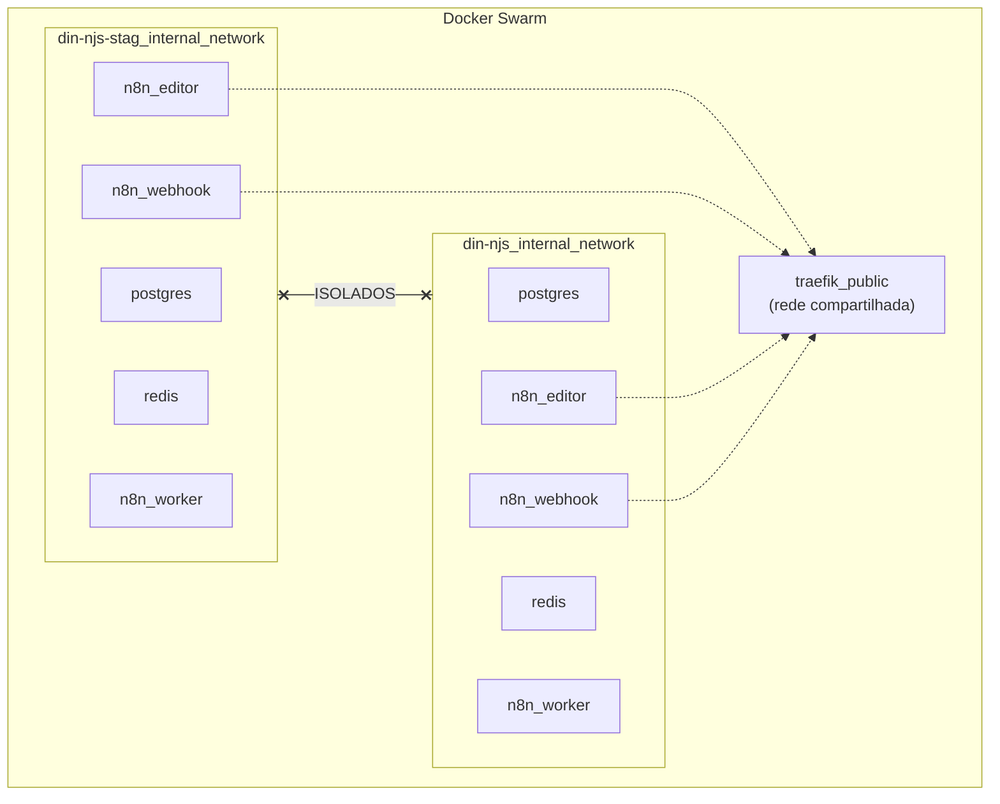
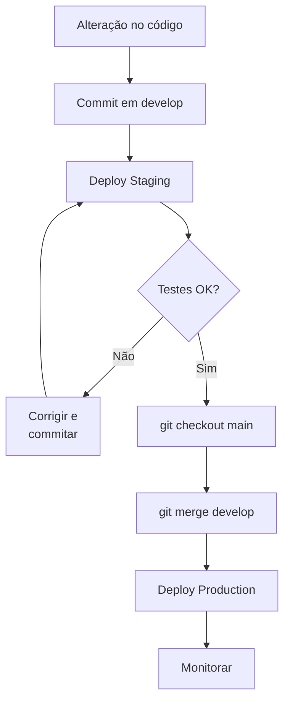

# Din-njs Stack - N8N Production Environment

**Stack:** din-njs-v3.yaml
**VPS:** Din-tools
**Autor:** Legolas @ Dinamo Pro

---

## Arquitetura dos Serviços



---

## Fluxo de Dados



---

## Pipeline de Branches e Deploy



---

## Isolamento de Redes (Swarm)



> O Docker Swarm adiciona automaticamente o prefixo do nome da stack nas redes, garantindo isolamento entre staging e produção.

---

## Diferenças de Variáveis por Ambiente

| Variável | Staging (`develop`) | Production (`main`) |
|----------|---------------------|---------------------|
| **Stack Name** | `din-njs-stag` | `din-njs` |
| **TRAEFIK_PREFIX** | `din-njs-stag` | `din-njs` |
| **POSTGRES_PORT_EXTERNAL** | `5436` | `5435` |
| **REDIS_PORT_EXTERNAL** | `6381` | `6380` |
| **N8N_HOST** | `din-njs-stag.dinamopro.com` | `din-njs.dinamopro.com` |
| **WEBHOOK_HOST** | `din-wh-stag.dinamopro.com` | `din-wh.dinamopro.com` |
| **DB_NAME** | `n8n_queue_stag` | `n8n_queue` |
| **N8N_ENCRYPTION_KEY** | Chave única staging | Chave única produção |

---

## Comandos de Deploy

### Staging (branch `develop`)
```bash
# Arquivo .env: din-njs-v3-stag.env
docker stack deploy -c din-njs-v3.yaml din-njs-stag --env-file din-njs-v3-stag.env
```

### Production (branch `main`)
```bash
# Arquivo .env: din-njs-v3.env
docker stack deploy -c din-njs-v3.yaml din-njs --env-file din-njs-v3.env
```

---

## Workflow de Atualização



---

## Recursos por Serviço

| Serviço | CPU Limite | Memória Limite | CPU Reserva | Memória Reserva |
|---------|------------|----------------|-------------|-----------------|
| PostgreSQL | 2.0 | 2048M | 0.5 | 512M |
| Redis | 1.0 | 2048M | 0.25 | 512M |
| n8n_editor | 1.0 | 1024M | 0.3 | 512M |
| n8n_webhook | 1.0 | 1024M | 0.3 | 512M |
| n8n_worker | 1.5 | 1536M | 0.4 | 768M |

---

## Volumes

| Volume | Tipo | Descrição |
|--------|------|-----------|
| `postgres_data` | External | Dados persistentes do PostgreSQL |
| `n8n_redis` | Local | Dados persistentes do Redis |

> **Nota:** O volume `postgres_data` deve ser criado manualmente antes do primeiro deploy.
